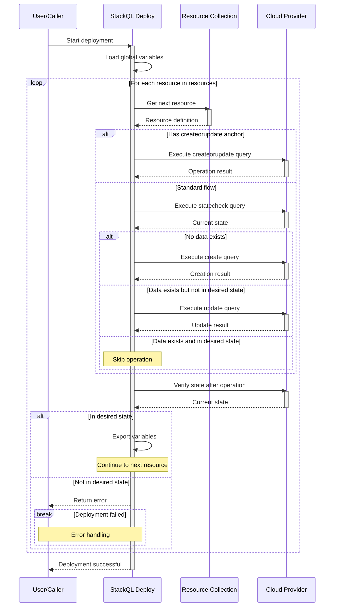

```mermaid
sequenceDiagram
    participant User as User/Caller
    participant Deploy as StackQL Deploy
    participant Resources as Resource Collection
    participant DB as Cloud Provider
    
    User->>Deploy: Start deployment
    activate Deploy
    Deploy->>Deploy: Load global variables
    
    loop For each resource in resources
        Deploy->>Resources: Get next resource
        activate Resources
        Resources-->>Deploy: Resource definition
        deactivate Resources
        
        alt Has createorupdate anchor
            Deploy->>DB: Execute createorupdate query
            activate DB
            DB-->>Deploy: Operation result
            deactivate DB
        else Standard flow
            Deploy->>DB: Execute statecheck query
            activate DB
            DB-->>Deploy: Current state
            deactivate DB
            
            alt No data exists
                Deploy->>DB: Execute create query
                activate DB
                DB-->>Deploy: Creation result
                deactivate DB
            else Data exists but not in desired state
                Deploy->>DB: Execute update query
                activate DB
                DB-->>Deploy: Update result
                deactivate DB
            else Data exists and in desired state
                Note over Deploy: Skip operation
            end
        end
        
        Deploy->>DB: Verify state after operation
        activate DB
        DB-->>Deploy: Current state
        deactivate DB
        
        alt In desired state
            Deploy->>Deploy: Export variables
            Note over Deploy: Continue to next resource
        else Not in desired state
            Deploy-->>User: Return error
            break Deployment failed
                Note over Deploy, User: Error handling
            end
        end
    end
    
    Deploy-->>User: Deployment successful
    deactivate Deploy
```    