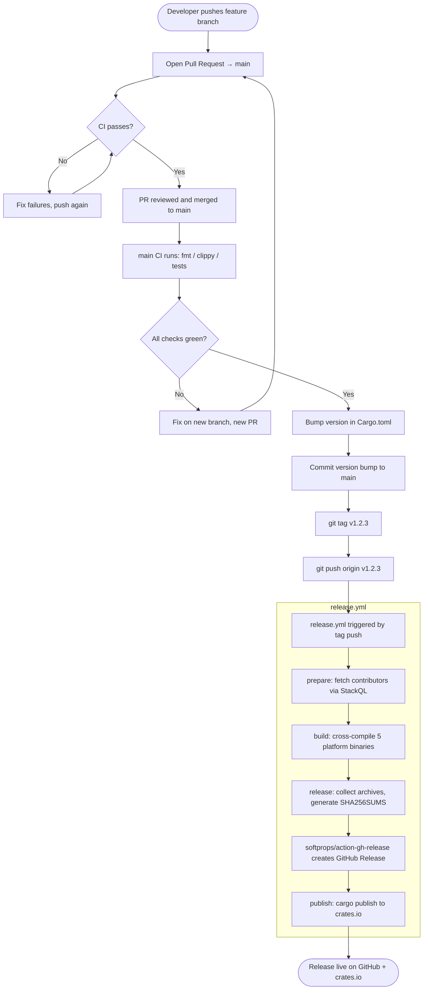

# Release Process

This document describes how to cut a release of `stackql-deploy` — from writing code
through to a published GitHub Release and crates.io package.

## Overview



## Step-by-step instructions

### 1. Write and push your changes

Work on a feature or fix branch — never commit directly to `main`.

```sh
# Start from an up-to-date main
git checkout main
git pull origin main

# Create your feature branch
git checkout -b feat/my-change

# Make changes, then stage and commit
git add src/...
git commit -m "feat: describe the change"

# Push to GitHub
git push -u origin feat/my-change
```

### 2. Open a Pull Request

Open a PR against `main` on GitHub. The following CI workflows must pass before
merging:

| Workflow | What it checks |
|----------|----------------|
| `ci-rust.yml` | `cargo fmt`, `cargo clippy`, `cargo test` |
| `ci-website.yml` | Docusaurus website build |

After review and approval, merge the PR using the **Squash and merge** or
**Merge commit** strategy. Avoid force-pushes to `main`.

### 3. Bump the version

After merging, update the version in `Cargo.toml` on `main` (or on a dedicated
`chore/release-vX.Y.Z` branch merged to `main`):

```toml
[package]
version = "1.2.3"   # ← bump this
```

Commit the change:

```sh
git add Cargo.toml Cargo.lock
git commit -m "chore: release v1.2.3"
git push origin main
```

> **Version format:** follow [Semantic Versioning](https://semver.org/) —
> `MAJOR.MINOR.PATCH`. Tags must use the `v` prefix (e.g. `v1.2.3`).

### 4. Tag the release

Create an annotated tag on the version-bump commit:

```sh
git tag -a v1.2.3 -m "Release v1.2.3"
```

### 5. Push the tag to trigger the release workflow

```sh
git push origin v1.2.3
```

Pushing a tag matching `v[0-9]+.[0-9]+.[0-9]+` triggers `.github/workflows/release.yml`.

### 6. Monitor the release workflow

Navigate to **Actions → Release** in the GitHub repository to watch progress.
The workflow runs four jobs in sequence:

| Job | Description |
|-----|-------------|
| **prepare** | Fetches the contributor list via StackQL and uploads it as an artifact |
| **build** | Cross-compiles binaries for all five platform targets in parallel |
| **release** | Collects archives, generates `SHA256SUMS`, and creates the GitHub Release |
| **publish** | Runs `cargo publish` to push the crate to crates.io |

A successful run results in:

- A GitHub Release at `https://github.com/stackql/stackql-deploy/releases/tag/v1.2.3`
  with the following assets attached:
  - `stackql-deploy-linux-x86_64.tar.gz` (contains `stackql-deploy`)
  - `stackql-deploy-linux-arm64.tar.gz` (contains `stackql-deploy`)
  - `stackql-deploy-macos-arm64.tar.gz` (contains `stackql-deploy`)
  - `stackql-deploy-macos-x86_64.tar.gz` (contains `stackql-deploy`)
  - `stackql-deploy-windows-x86_64.zip` (contains `stackql-deploy.exe`)
  - `SHA256SUMS`
- The crate published at `https://crates.io/crates/stackql-deploy`

### 7. Verify the crates.io publish

```sh
cargo search stackql-deploy
# or visit https://crates.io/crates/stackql-deploy
```

Confirm the version shown matches the tag you pushed.

---

## Required secrets

The following repository secrets must be configured in **Settings → Secrets and
variables → Actions**:

| Secret | Used by | Description |
|--------|---------|-------------|
| `CARGO_REGISTRY_TOKEN` | `publish` job | API token from [crates.io](https://crates.io/settings/tokens) with `publish-new` and `publish-update` scopes |
| `GITHUB_TOKEN` | `release` job | Automatically provided by GitHub Actions — no manual setup needed |

---

## Deleting / re-pushing a bad tag

If you need to redo a release tag (e.g. you pushed the wrong commit):

```sh
# Delete locally
git tag -d v1.2.3

# Delete on GitHub (this will also cancel any in-flight release workflow run)
git push origin :refs/tags/v1.2.3

# Re-tag the correct commit and push again
git tag -a v1.2.3 -m "Release v1.2.3" <correct-commit-sha>
git push origin v1.2.3
```

> **Note:** If the crates.io publish already succeeded, you **cannot** re-publish
> the same version. Bump to a patch version (e.g. `v1.2.4`) instead.
