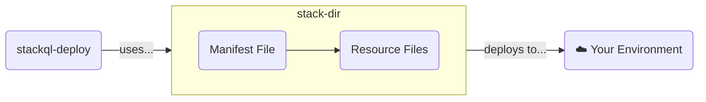

import File from '/src/components/File';

`stackql-deploy` is a model driven, declarative framework for provisioning, de-provisioning and testing cloud resources.  Heard enough and ready to get started? Jump to a [__Quick Start__](#quick-start).  

## Installing `stackql-deploy`

`stackql-deploy` is distributed as a standalone binary with no runtime dependencies required.

import Tabs from '@theme/Tabs';
import TabItem from '@theme/TabItem';

<Tabs>
<TabItem value="macos" label="macOS">

**Using Homebrew (recommended):**

```bash
brew tap stackql/tap
brew install stackql-deploy
```

**Or download the installer package:**

Download the latest `.pkg` installer from the [GitHub Releases](https://github.com/stackql-labs/stackql-deploy-rs/releases) page.

</TabItem>
<TabItem value="linux" label="Linux">

**Download the binary:**

```bash
curl -L https://github.com/stackql-labs/stackql-deploy-rs/releases/latest/download/stackql-deploy-linux-x86_64.tar.gz | tar xz
sudo mv stackql-deploy /usr/local/bin/
```

</TabItem>
<TabItem value="windows" label="Windows">

**Using Chocolatey (recommended):**

```powershell
choco install stackql-deploy
```

**Or download the MSI installer:**

Download the latest `.msi` installer from the [GitHub Releases](https://github.com/stackql-labs/stackql-deploy-rs/releases) page.

</TabItem>
</Tabs>

For more installation options, see the [__Install__](/install) page.

## How `stackql-deploy` works

The core components of `stackql-deploy` are the __stack directory__, the `stackql_manifest.yml` file and resource query (`.iql`) files. These files define your infrastructure and guide the deployment process.  

`stackql-deploy` uses the `stackql_manifest.yml` file in the `stack-dir`, to render query templates (`.iql` files) in the `resources` sub directory of the `stack-dir`, targeting an environment (`stack-env`).  `stackql` is used to execute the queries to deploy, test, update or delete resources as directed.  This is summarized in the diagram below:



### `stackql_manifest.yml` File

The `stackql_manifest.yml` file is the basis of your stack configuration. It contains the definitions of the resources you want to manage, the providers you're using (such as AWS, Google Cloud, or Azure), and the environment-specific settings that will guide the deployment.  

This manifest file acts as a blueprint for your infrastructure, describing the resources and how they should be configured.  An example `stackql_manifest.yml` file is shown here:

<File name='stackql_manifest.yml'>

```yaml
version: 1
name: "my-azure-stack"
description: description for "my-azure-stack"
providers:
  - azure
globals:
  - name: subscription_id
    description: azure subscription id
    value: "{{ AZURE_SUBSCRIPTION_ID }}"
  - name: location
    description: default location for resources
    value: eastus
  - name: global_tags
    value:
      provisioner: stackql
      stackName: "{{ stack_name }}"
      stackEnv: "{{ stack_env }}"
resources:
  - name: example_res_grp
    props:
      - name: resource_group_name
        value: "{{ stack_name }}-{{ stack_env }}-rg"
    exports:
      - resource_group_name  
```

</File>

The `stackql_manifest.yml` file is detailed [__here__](/manifest-file).

### Resource Query Files

Each resource or query defined in the `resources` section of the `stackql_manifest.yml` has an associated StackQL query file (using the `.iql` extension by convention).  The query file defines queries to deploy and test a cloud resource.  These queries are demarcated by query anchors (or hints).  Available query anchors include:

- `exists` : tests for the existence or non-existence of a resource
- `create` : creates the resource in the desired state using a StackQL `INSERT` statement
- `update` : updates the resource to the desired state using a StackQL `UPDATE` statement
- `createorupdate`: for idempotent resources, uses a StackQL `INSERT` statement
- `statecheck`: tests the state of a resource after a DML operation, typically to determine if the resource is in the desired state
- `exports` :  variables to export from the resource to be used in subsequent queries
- `delete` : deletes a resource using a StackQL `DELETE` statement

An example resource query file is shown here:

<File name='example_res_grp.iql'>

```sql
/*+ exists */
SELECT COUNT(*) as count FROM azure.resources.resource_groups
WHERE subscriptionId = '{{ subscription_id }}'
AND resourceGroupName = '{{ resource_group_name }}'

/*+ create */
INSERT INTO azure.resources.resource_groups(
   resourceGroupName,
   subscriptionId,
   data__location
)
SELECT
   '{{ resource_group_name }}',
   '{{ subscription_id }}',
   '{{ location }}'

/*+ statecheck, retries=5, retry_delay=5 */
SELECT COUNT(*) as count FROM azure.resources.resource_groups
WHERE subscriptionId = '{{ subscription_id }}'
AND resourceGroupName = '{{ resource_group_name }}'
AND location = '{{ location }}'
AND JSON_EXTRACT(properties, '$.provisioningState') = 'Succeeded'

/*+ exports */
SELECT '{{ resource_group_name }}' as resource_group_name

/*+ delete */
DELETE FROM azure.resources.resource_groups
WHERE resourceGroupName = '{{ resource_group_name }}' AND subscriptionId = '{{ subscription_id }}'
```

</File>

Resource queries are detailed [__here__](/resource-query-files).

### `stackql-deploy` commands

Basic `stackql-deploy` commands include:

- `build` : provisions a stack to the desired state in a specified environment (including `create` and `update` operations if necessary)
- `test` : tests a stack to confirm all resources exist and are in their desired state
- `teardown` : de-provisions a stack

here are some examples:

```bash title="deploy my-azure-stack to the prd environment"
stackql-deploy build my-azure-stack prd \
-e AZURE_SUBSCRIPTION_ID=00000000-0000-0000-0000-000000000000
```

```bash title="test my-azure-stack in the sit environment"
stackql-deploy test my-azure-stack sit \
-e AZURE_SUBSCRIPTION_ID=00000000-0000-0000-0000-000000000000
```

```bash title="teardown my-azure-stack in the dev environment"
stackql-deploy teardown my-azure-stack dev \
-e AZURE_SUBSCRIPTION_ID=00000000-0000-0000-0000-000000000000
```

For more detailed information see [`cli-reference/build`](/cli-reference/build), [`cli-reference/test`](/cli-reference/test), [`cli-reference/teardown`](/cli-reference/teardown), or other commands available.


### `stackql-deploy` deployment flow

`stackql-deploy` processes the resources defined in the `stackql_manifest.yml` in top down order (`teardown` operations are processed in reverse order).


## Quick Start

To get up and running quickly, `stackql-deploy` provides a set of quick start templates for common cloud providers. These templates include predefined configurations and resource queries tailored to AWS, Azure, and Google Cloud, among others.

- [**AWS Quick Start Template**](/template-library/aws/vpc-and-ec2-instance): A basic setup for deploying a VPC, including subnets and routing configurations.
- [**Azure Quick Start Template**](/template-library/azure/simple-vnet-and-vm): A setup for creating a Resource Group with associated resources.
- [**Google Cloud Quick Start Template**](/template-library/google/k8s-the-hard-way): A configuration for deploying a VPC with network and firewall rules.

These templates are designed to help you kickstart your infrastructure deployment with minimal effort, providing a solid foundation that you can customize to meet your specific needs.